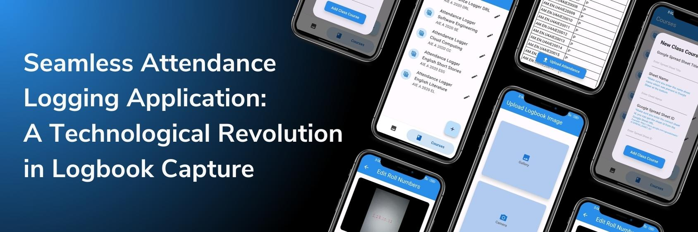

# Seamless Attendance Logger



## Introduction 👨‍💻
In the era of education, efficient attendance tracking is more than just a daily task; it’s a vital step into the fabric of academic success. Traditional methods of logging student attendance, often reliant on manual recording in logbooks, have remained a steadfast yet cumbersome practice for generations. As the twenty-first century draws near its end, there arises a growing necessity for utilizing innovative tactics which capitalize on technological means to better this vital process.

Generally log books are used to maintain the attendance of students and log books contain the roll numbers of students who are absent for that class, so if we can manage to extract those roll numbers from the log book then we can create a pipeline which eventually updates the attendance records in the college management software. There are multiple steps in the process a professor has to keep record such writing in the log book then copying to an excel sheet and then to upload in the required software such college management software. But the whole process can be automated with the help of Image processing techniques such as text extraction.

## Prerequisites ✍️

### Google Sheet Integration 🏭️
- The app stores the attendance data in the Google Sheets, it is important to enable the Google Sheets API from the Google Cloud Console. The following are the steps to set up a service account in the google cloud console. 
- In the Cloud Console, navigate to ”APIs & Services” → ”Library” Search for Google Sheets API” and click ”Enable.” 
- In the Cloud Console, navigate to ”APIs & Services” →”Credentials.” 
- Click on ”Create Credentials” and select ”Service Account.” 
- Provide a name for your service account and select the role that suits your needs (e.g., ”Editor” for full access). 
- Select the JSON key type and click ”Create.” 
- Download & Save the JSON keyfile.
- Create a `.env` file in the project root folder, and declare the JSON data to the `CREDENTIALS` variable.
    ```
    CREDENTIALS= {"type": "","project_id": "","private_key_id": "","private_key": "","client_email": "","client_id": "","auth_uri": "","token_uri": "","auth_provider_x509_cert_url": "","client_x509_cert_url": "","universe_domain": ""}
    ```

### Setup Google Sheets 📖

To store attendance data efficiently in Google Sheets, we have defined a specific format.

**Key Attributes:**

- The format includes three fixed attributes that need to be predefined:
  - **ID:** Unique identifier for each student
  - **Student Name:** Full name of the student
  - **Student Roll Number:** A unique identifier for each student.

**Attendance Data Format:**

- For each dynamic attribute (date), the cells below it will contain:
  - "P" if the student is Present on that date.
  - "A" if the student is Absent on that date.

## How it works? 🏃‍♂️


## Results 📱


## Getting Started

This project is a starting point for a Flutter application.

A few resources to get you started if this is your first Flutter project:

- [Lab: Write your first Flutter app](https://docs.flutter.dev/get-started/codelab)
- [Cookbook: Useful Flutter samples](https://docs.flutter.dev/cookbook)

For help getting started with Flutter development, view the
[online documentation](https://docs.flutter.dev/), which offers tutorials,
samples, guidance on mobile development, and a full API reference.

**<p align="center">Happy Coding 😎</p>**